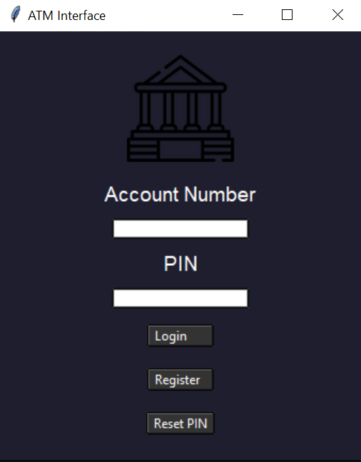
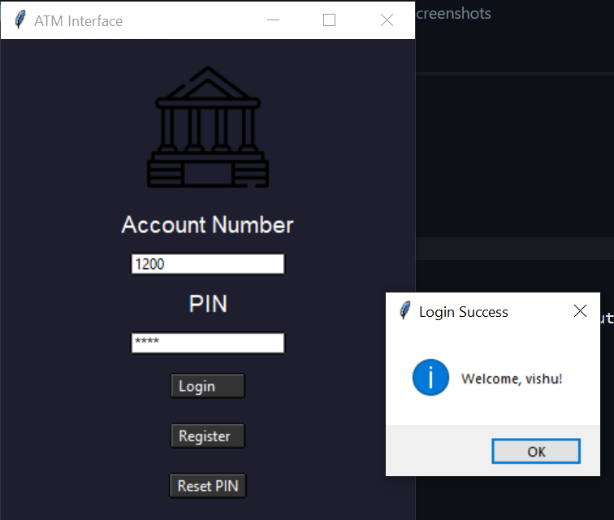
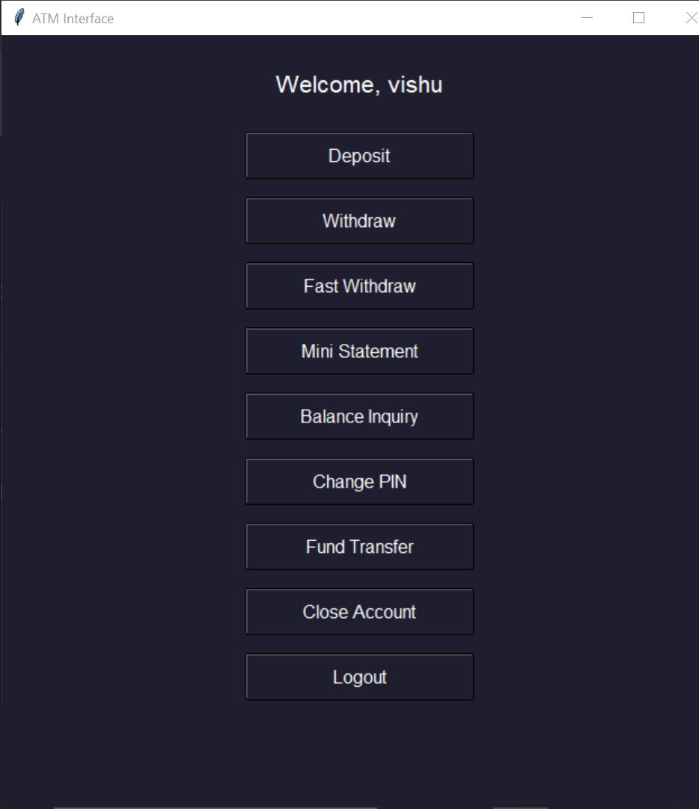

# 📢 Internship Task Details
This project is part of my internship at Brainwave Matrix Solutions, where I am working as a Python Programming Intern.

# 🚩 Task Objective:
Create a fully functional ATM Interface using Python.

# 📝 Task 1 Details:
Project Goal: Develop a complete ATM interface with core functionalities like authentication, balance inquiry, cash withdrawal, deposit, transaction history, fund transfer, and more.

# 💳 Modern ATM Interface

The *Modern ATM Interface* is a project designed to simulate a real-world ATM experience using a user-friendly graphical interface built with *Tkinter* for the frontend and *Express.js* for the backend.

## 🚀 Features
- 🏦 *User Authentication:* Users can securely log in or sign up.
- 💰 *Check Account Balance:* Displays the current balance of the user.
- 💸 *Cash Withdrawal:* Allows users to withdraw a specific amount from their account.
- 💵 *Cash Deposit:* Enables adding money to the user's account.
- 📄 *Transaction History:* Shows a detailed log of past transactions.
- 🔄 *Fund Transfer:* Transfer money to other accounts seamlessly.
- 🧾 *Mini Statement:* Quick view of recent transactions.
- 🚀 *Fast Withdrawal:* Withdraws a predefined amount quickly.
- 🔐 *Reset PIN:* Allows users to reset their account PIN securely.
- 🔄 *Change PIN:* Users can change their account PIN.
- 🗑 *Account Deletion:* Option to delete the user account permanently.
- 🚪 *Logout:* Securely logs the user out of the system.

## 🛠 Tech Stack
- *Frontend:* Python (Tkinter)
- *Backend:* Express.js (Node.js)
- *Database:* MongoDB

## 🎮 How It Works
1. *User Authentication:*
   - Users can log in or sign up through a simple form.
   - Successful login redirects users to the main ATM interface.

2. *Main Interface:*
   - The interface provides options like Balance Inquiry, Cash Withdrawal, Deposit, Transaction History, Fund Transfer, Mini Statement, Fast Withdrawal, PIN Reset, PIN Change, Account Deletion, and Logout.

3. *Transaction Management:*
   - Each transaction is securely processed with backend validation.
   - The system maintains a log of all transactions for record-keeping.

4. *Fund Transfer:*
   - Users can transfer funds to other registered accounts.

5. *Mini Statement:*
   - Displays a brief summary of recent transactions.

6. *Fast Withdrawal:*
   - Allows quick cash withdrawal of a predefined amount.

7. *Security:*
   - Passwords are encrypted before storing in the database.
   - User sessions are managed securely to prevent unauthorized access.
   - Sends alerts for any suspicious account activity.

## 🧠 Prerequisites
- Python (>=3.7)
- Node.js & npm
- MongoDB

## 🚦 Getting Started
sh
# Clone the repository
git clone <repository_url - https://github.com/iamkrVishu/Brainwave_Matrix_Intern.git>

# Backend Setup
cd backend
npm install
node app.js

# Frontend Setup
cd frontend
python atm.py

## 📸 Screenshots

## 🤝 Contributing
Feel free to open issues and submit pull requests. Contributions are welcome!

## 📄 License
This project is licensed under the MIT License.

Happy Coding! 😊
